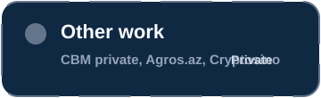

  

<h1 align="center">Hi, I'm Murad Narimanli</h1>

  <strong>Senior Frontend Developer / Frontend Chapter Lead</strong> 
  Building high-scale fintech, banking, enterprise, and gaming platforms.

  
  
  
  

---

  

  

  

  

  
  
  
  
  
  
  
  
  
  

  

  

