<p align="center">
  
</p>

<h1 align="center">Hi, I'm Murad Narimanli</h1>

<p align="center">
  <strong>Senior Frontend Developer / Frontend Chapter Lead</strong><br />
  Building high-scale fintech, banking, enterprise, and gaming platforms.
</p>

<p align="center">
  <a href="https://murad-narimanli.vercel.app/">Portfolio</a>
  |
  <a href="https://www.linkedin.com/in/murad-n%C9%99rimanl%C4%B1-549389130/">LinkedIn</a>
  |
  <a href="https://github.com/murad-narimanli">GitHub</a>
  |
  <a href="mailto:narimanli.murad@gmail.com">Email</a>
</p>

---

## Snapshot

I build high-scale frontend systems with Vue, React, Next.js, Angular, microfrontend architecture, REST, and GraphQL. I have 7+ years of frontend experience, with a strong focus on performance, accessibility, CI/CD, API integrations, and mentoring developers.

| Focus | What I work on |
| --- | --- |
| Banking and fintech | Internet banking, enterprise dashboards, reporting tools, secure UI architecture |
| Gaming platforms | Real-time game data, user activity flows, reusable component systems |
| Frontend architecture | Microfrontends, Webpack optimization, CI/CD, API-heavy applications |

## About Me

- Currently Senior Frontend Developer / Frontend Chapter Lead at Rabitabank OJSC.
- Experienced in internet banking, enterprise dashboards, gambling and gaming platforms, e-commerce, CMS projects, and analytics systems.
- Specialized in Vue 2/3, Composition API, React, Next.js, Angular, and microfrontend architecture.
- Strong with REST API and GraphQL integrations, Webpack optimization, GitLab CI/CD, GitHub Actions, and reusable UI architecture.

## Tech Stack

```txt
Frontend     HTML5, CSS3, Sass, SCSS, JavaScript, TypeScript, Vue 2/3, React, Next.js, Nuxt.js, Angular, jQuery
State and UI Vuex, Redux, Redux Toolkit, Composition API, Options API, Material UI, Chakra UI, Ant Design, Quasar
APIs         REST API, GraphQL, Axios, Supabase, Strapi
Tooling      Git, Webpack, GitHub Actions, GitLab CI/CD, Jest, RxJS, Lodash, D3, Grunt
```

## Featured Strengths

- Large-scale Vue 2/3 and Composition API applications.
- React and Next.js dashboards, panels, and SSR-focused interfaces.
- Microfrontend architecture for modular, scalable frontend systems.
- REST and GraphQL integrations for complex reporting and product flows.
- Webpack performance optimization and CI/CD pipelines with GitLab and GitHub Actions.

## Experience Highlights

**Rabitabank OJSC**

Senior Frontend Developer / Frontend Chapter Lead | 08/2021 - Present

- Developed and maintained a large-scale internet banking system using Vue 2/3 and Composition API.
- Designed microfrontend architecture for better module isolation and scalability.
- Integrated REST APIs and GraphQL queries for reporting tools.
- Configured custom Webpack builds, optimized bundles, and enabled CI/CD pipelines with GitLab.

**King Entertainment**

Senior Frontend Developer | 08/2025 - 01/2026

- Built dynamic user interfaces for gambling and gaming platforms using React, Next.js, and Node.js.
- Integrated APIs for real-time game data and user activity tracking.
- Contributed to reusable component libraries and client-side rendering optimization.

**ABB Bank OJSC (ABB Innovation)**

Outsource Frontend Developer | 06/2024 - 09/2024

- Developed internal enterprise dashboards using React and Next.js.
- Applied microfrontend practices in high-security environments.
- Integrated REST APIs and deployed updates through CI/CD workflows.

## Selected Portfolio

- [Sweeps](https://sweeps.us) - site and control panel
- [Internet Banking of RabitaBank OJSC](https://ib.rabitabank.com/)
- [Ledger Investing](https://www.ledgerinvesting.com/)
- [Vac.az](https://vac.az/)
- [Game Islands](https://gamesislands.com/)
- [RiverMonster](https://rivermonster-casino.com/)
- [Vegasx](https://vegasx-casino.com/)
- [Flamingo7](https://flamingo7-casino.com/)
- [Ultrapower](https://ultrapower-casino.com/)
- CBM engineering internal system - private
- Agros.az
- Cryptosino

## Education

- Master's degree in Programming and Automation, [Azerbaijan State Oil and Industry University](https://asoiu.edu.az/home) | 2020 - 2022
- Bachelor's degree in Telecommunication Engineering, [Azerbaijan State Oil and Industry University](https://asoiu.edu.az/home) | 2016 - 2020

## Languages

- English
- Russian
