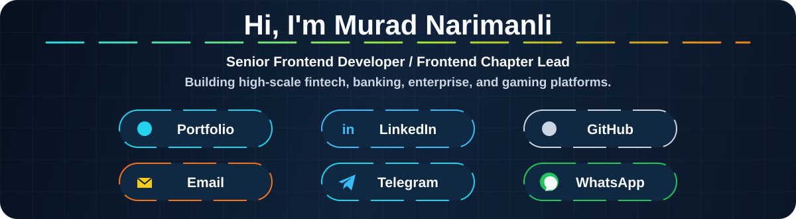

  

  
  <map name="contact-links">
    <area shape="rect" coords="180,166,410,222" href="https://murad-narimanli.vercel.app/" alt="Portfolio" />
    <area shape="rect" coords="485,166,715,222" href="https://www.linkedin.com/in/murad-n%C9%99rimanl%C4%B1-549389130/" alt="LinkedIn" />
    <area shape="rect" coords="790,166,1020,222" href="https://github.com/murad-narimanli" alt="GitHub" />
    <area shape="rect" coords="180,246,410,302" href="mailto:narimanli.murad@gmail.com" alt="Email" />
    <area shape="rect" coords="485,246,715,302" href="https://t.me/Murad235" alt="Telegram" />
    <area shape="rect" coords="790,246,1020,302" href="https://wa.me/994556230599" alt="WhatsApp" />
  </map>

  

---

  

  

  

  

  
  
  
  
  
  
  
  
  

  

  

